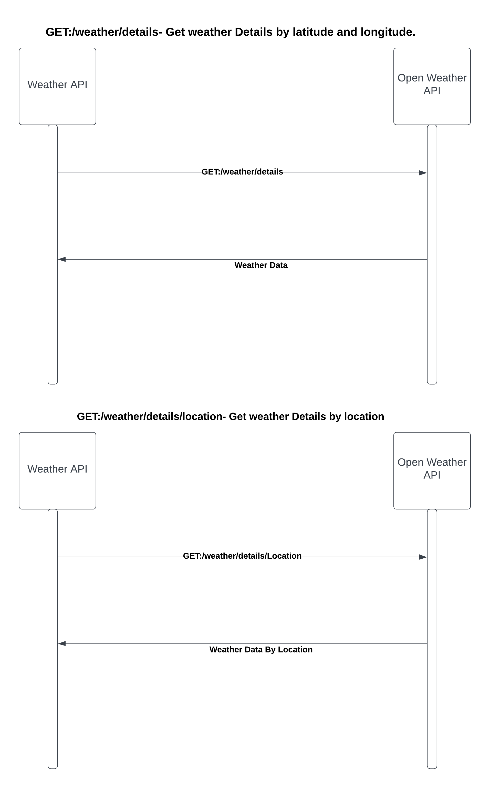

# Codebase for Weather Application using spring boot + Basic Authentication+Feign Client + Swagger3 +WireMock + Jacoco

Steps to run this project:

1. Clone this Git repository.
2. Navigate to the folder `weather-app`.
3. Run `mvn clean install` to build the war file in your local machine.
4. To start the application, execute `mvn spring-boot:run` and access http://localhost:8080/healthCheck
5. Basic Authentication
   Username:testUser
   Password:testPassword
6. Link to SWAGGER:http://localhost:8080/swagger-ui/index.html
7. GET:/weather/details- Get weather Details by latitude and longitude. For
   e.g: http://localhost:8080/weather/details?latitude=33.44&longitude=151.20
8. GET:/weather/details/location- Get weather Details by latitude and longitude. For
   e.g: http://localhost:8080/weather/details/location?location=sydney
9. Import the WeatherAPI.collections file to see sample requests
10. To see the Jacoco results for checking code coverage, perform step 3 and go to target/site/jacoco/index.html and
    open in browser.
11. Sequence Diagram: 
